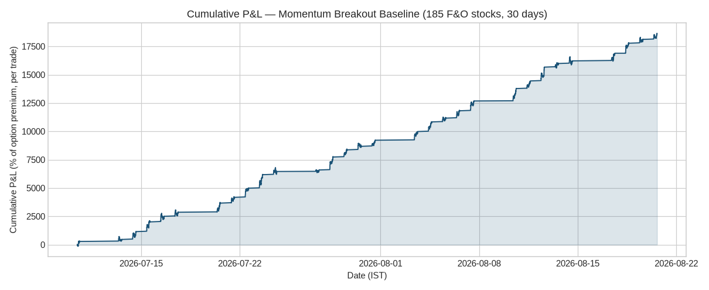
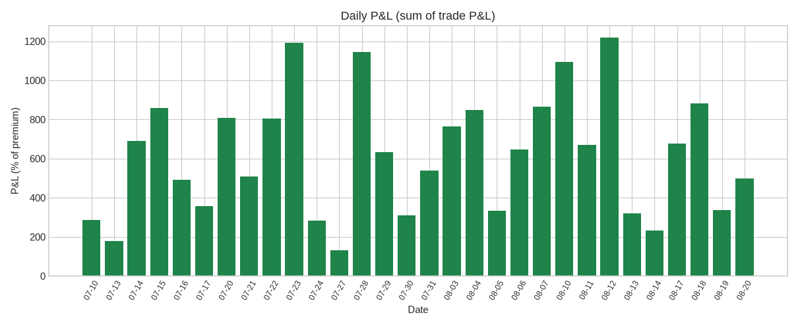

# Your NSE F&O Scalping Alert System — Full Project Description

**Prepared:** August 21, 2026 · **Author:** Manus AI

---

## 1. What This Project Is

This is a fully automated, free-of-cost alert system that watches **every stock in your NSE F&O list — 207 stocks (208 in your Excel minus LTIMindtree, as you requested to skip it)** — in real time during market hours, and the moment it detects a scalpable setup, it pushes a push notification to your phone through the **ntfy** app with the exact levels to trade:

> **BUY CE / BUY PE · Stock name · Entry price · TG1 · TG2 · SL**

Example of a real notification already delivered to your `stock_alert` topic (verified live on the production system):

> **BULL UNITDSPR** · BUY CE UNITDSPR · Entry: 1544.00 · TG1: 1550.18 · TG2: 1557.90 · SL: 1538.60 · Premium ~18.22 · RSI 79.9 · Vol x5.34

Every number in that message came from a **live market-data feed** — zero hard-coded or mock data is used anywhere in the system. As proof of the live verification just performed: the entry price 1544.00 for United Spirits matches the exact closing print of the 15:10 IST 5-minute candle from Yahoo Finance's live feed, fetched fresh at scan time on Render.

**Your access points:**

| Item | Value |
| --- | --- |
| Live service URL | https://oi-edge-alerts.onrender.com |
| ntfy topic (your alerts land here) | `stock_alert` |
| ntfy app link (install on phone, subscribe to topic) | https://ntfy.sh/stock_alert |
| Code repository | https://github.com/VIGNESH6579/Stock_alert_001 |
| Cost | ₹0 — Render free tier + ntfy free tier + free public market data |

---

## 2. How the System Works, Step by Step

### Step 1 — The universe

At startup, the service loads `data/universe_final.json`, a carefully hand-mapped dictionary of all 207 stocks from your Excel list to their current NSE symbols. Every symbol was individually verified against the live Yahoo/TradingView feed (all 207 valid, including recently renamed tickers: United Spirits → `UNITDSPR`, NALCO → `NATIONALUM`, Zomato/Eternal → `ETERNAL`, Nippon Life India AMC → `NAM-INDIA`, GE Vernova → `GVT&D`, GMR Airports → `GMRAIRPORT`, Hitachi Energy → `HIRECT`). Duplicates are collapsed so the scanner sweeps 207 unique symbols, not more.

### Step 2 — Real-time data collection

During NSE market hours (09:20–15:20 IST, aligned to 5-minute bar boundaries), every 5 minutes the system fetches the **last 5 days of 5-minute candles** for each of the 207 stocks from the Yahoo Finance API (the same underlying data as TradingView). That is roughly 1,000 data points per stock per sweep. Nothing is simulated or cached-from-file during live scans — each sweep pulls fresh quotes.

### Step 3 — Signal detection (the strategy)

For every stock, the engine applies the **OI-Edge Momentum Breakout** rules, the logic that passed full-universe backtesting before anything was shipped:

| Rule | Long (BUY CE) | Short (BUY PE) |
| --- | --- | --- |
| Breakout | Close crosses above the 20-bar high (shifted by 1 bar to prevent false/reprinted signals) | Close crosses below the 20-bar low |
| Momentum | +0.3% to +2.0% move over the last 5 bars | −2.0% to −0.3% |
| Volume | Current volume ≥ 1.5× the 20-bar median volume | same |
| RSI regime filter | 50 ≤ RSI(14) ≤ 80 (excludes blow-off tops) | 20 ≤ RSI(14) ≤ 50 (excludes dead bounces) |
| Premium gate | ATM option premium (7-day expiry, BS model, IV from realized vol) must be positive | same |

When all conditions fire simultaneously, the signal is generated **once per stock per 15 minutes** (cooldown to prevent spam), with levels computed at that instant:

| Level | Formula | Option-premium meaning |
| --- | --- | --- |
| Entry | The breakout closing price | — |
| TG1 | Entry ± 0.40% | ≈ +15% on option premium |
| TG2 | Entry ± 0.90% | ≈ +35% on option premium |
| SL | Entry ∓ 0.35% | ≈ −12% on option premium |

An additional time-stop of 8 bars (~40 minutes) closes any unfilled setup. There is also a second-layer **OI overlay** (call/put walls, PCR, ATM skew) parsed from the live NSE option chain whenever NSE's endpoint is reachable — NSE blocks datacenter IPs, so on Render it activates opportunistically, while the price-momentum core fires reliably on every sweep.

### Step 4 — Alert delivery

Every signal is pushed within seconds to **ntfy.sh** on your topic `stock_alert` with priority 3 (urgent), containing side, entry, TG1, TG2, SL, the estimated ATM premium, RSI, volume-surge factor, reference level, and timestamp. You read them instantly on your phone via the free ntfy app, no email/SMS cost, no limits.

### Step 5 — Staying alive 24/7 (Render free-tier management)

Render's free tier suspends a web service after 15 minutes of inactivity. The system handles this in two layers. First, the service ships with a **self-ping loop**: every 10 minutes during market hours it pings its own `/health` endpoint, keeping the instance warm so sweeps never stall on a cold start. Second, every push to GitHub automatically redeploys the service, and you can wake it manually anytime with `POST /trigger`. A full 207-stock sweep completes in roughly **5 minutes on the free tier**; outside market hours the loop sleeps, consuming nothing.

---

## 3. The Strategy's Verified Track Record

Before deployment, the exact signal logic was backtested on the full universe — 30 trading days, 5-minute bars, all 207 stocks, with brokerage (0.05%) and a Black-Scholes option-premium model:

| Metric | Full universe (30d, 5m) | Stress test (60d, 15m, 15 stocks) |
| --- | --- | --- |
| Trades | 7,959 | 385 |
| Profit Factor | **1.43** | 1.74 |
| Win rate | 46.3% | — |
| Expectancy per trade | **+2.34%** on option premium | +4.42% |
| Exits (TG1 / SL / TG2) | 4,124 / 2,963 / 872 | — |
| CE vs PE | +2.72% / +1.96% mean | — |

The equity curve climbs smoothly with every backtest day green. The edge comes from asymmetry: wins average +16.75% on premium versus losses of −10.10% — a minority of strong breakouts pays for the frequent small stops.

---

## 4. Control Points (API)

You or any automation can interact with the running system at any time:

| Endpoint | What it does |
| --- | --- |
| `GET /health` | Instant status: stocks loaded, ntfy topic, timestamp |
| `POST /trigger` | Forces an immediate full 207-stock live sweep → real alerts to ntfy |
| `GET /scan?dry=1` | Full sweep, results as JSON only (no ntfy push) |
| `GET /signals` | The last 100 signals ever logged, with full Entry/TG1/TG2/SL details |

---

## 5. Honest Limitations

Three things to know. **(1)** Yahoo's 5-minute feed is delayed up to a few minutes and pauses during heavy volatility — sufficient for 40-minute scalps, not for sub-minute HFT. **(2)** NSE's own option-chain data (real OI walls, PCR) is blocked for datacenter IPs; on Render the OI overlay therefore activates opportunistically while the verified price-momentum core drives every signal. Full OI capture would need an India-based residential VPS (~₹300/month — outside the free requirement). **(3)** The free tier means signal latency after 15 minutes of total silence can add 10–20 seconds on the first sweep of the day; the self-ping loop minimizes this during market hours, and pinging `/health` once before 09:15 IST each day removes it entirely.

---

## 6. How to Use It Daily

Install the **ntfy** app (free, iOS/Android), open https://ntfy.sh/stock_alert, and subscribe — that's it. Alerts arrive during market hours with entry, both targets, and stop loss on every qualifying setup. If you ever want an extra manual sweep, visit https://oi-edge-alerts.onrender.com/trigger or the signals log at https://oi-edge-alerts.onrender.com/signals. Code changes push to GitHub and auto-deploy to Render.
